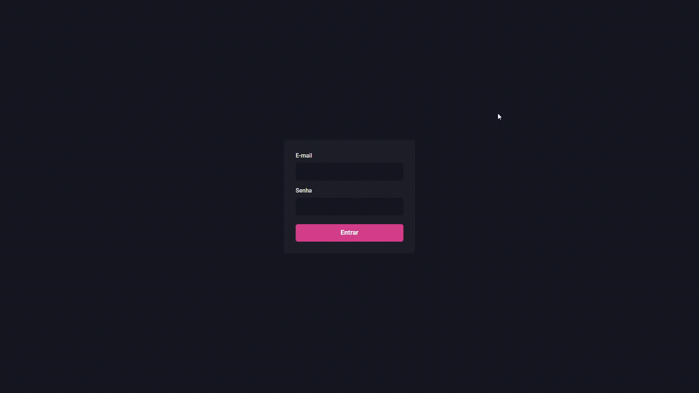

<h1 align='center'>
  Dashgo - Ignite (Rocketseat)
</h1>

<div align='center'>
  
</div>

<h2>Para testar o app localmente, siga os seguintes passos:</h2>

- Clonar o respositório
  ```bash
  git clone https://github.com/matosgabriel/ignite-reactjs-dashgo.git
  ```
- Instalar as dependências do projeto
  ```bash
  yarn install
  ```
- Executar o app em modo desenvolvedor
  ```bash
  yarn dev
  ```
- Acessar o app via navegador no endereço http://localhost:3000
